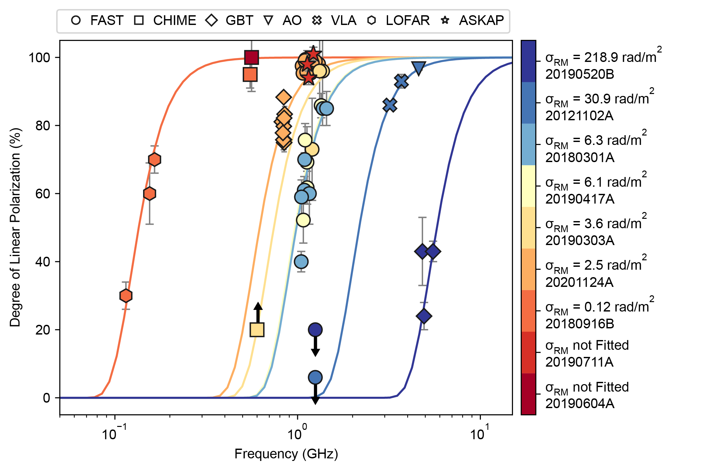
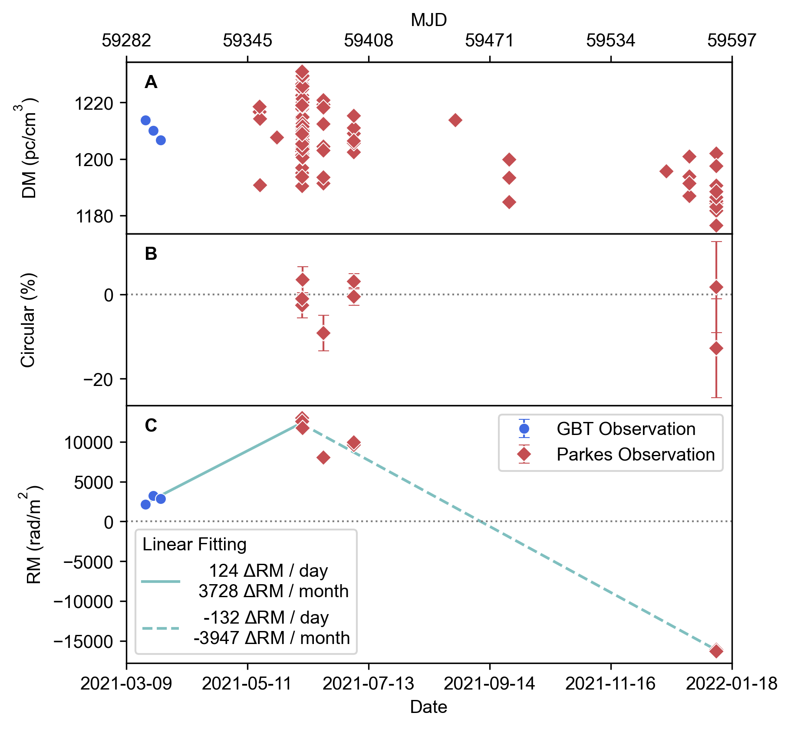

<div align="center">

# Rotation Measure Scatter (RMS)

_✨ Code repository for Papers ✨_  
**Frequency Dependent Polarization of Repeating Fast Radio Bursts - Implications for Their Origin** </br>
**Magnetic Field Reversal around an Active Fast Radio Burst**

</div>

<p align="center">
  <a href="https://github.com/SukiYume/RMS">
    
  </a>
  <a href="https://github.com/SukiYume/RMS">
    
  </a>
</p>

## Description

### RM Scatter
  
  In this paper, we report polarization measurements of five repeating FRBs. Combining these with archival observations, we identify trends of lower polarisation at lower frequencies. We model this behaviour as multi-path **Rotation Measure Scatter (RMS)**. 

  

  Sources with higher **RMS** have higher *RM magnitude* and *scattering timescales*, indicating a complex environment near the sources, such as a supernova remnant or a pulsar wind nebula, consistent with FRBs arising from young stellar populations.

  Figure 2, 3, and 4 of this paper are plotted in `RMS-Figure.ipynb`. `Polarization-RM.ipynb` contains Figure 1 and the measurements of FRBs' Rotation Measure. Data and Figures are stored in `CalData` and `Figure`, respectively.

### RM Reverse

  In this paper, we report direct evidence for a B-field reversal based on the observed sign change and extreme variation of FRB~20190520B's RM.

  

  The implied short-term change of the B-field configuration in or around the FRB could be due to the vicinity of massive black holes, or a magnetized companion star in binary systems, or a young supernova remnant along the line of sight.

  All figures of this paper are plotted in `RMR-Figure.ipynb`.

## Structure

  `ModulePy` contains two methods for measuring RM, **RM Synthesis** in `rm_synthesis.py`, and **RM QU Fitting** in `rm_qu_fitting.py`. The code usage method shows in `code_usage.py`.

  ```bash
  `-- RMS
      |-- CalData
      |   |-- 210608_135610_21.rf.TSb4.txt
      |   |-- 190417-FAST.csv
      |   |-- 201124-FAST.csv
      |   |-- 201124-GBT.csv
      |   |-- RM-190303-1.txt
      |   |-- RM-190417-7.txt
      |   |-- RM-190520-437.txt
      |   |-- RM-201124-26.txt
      |   `-- RM-437.txt
      |-- Data
      |   |-- 210608_135610_21.rf.TSb4
      |   `-- Parkes-DM.csv
      |-- Figure
      |   |-- RM-Time-New.png
      |   `-- RM_Scatter_New.png
      |-- ModulePy
      |   |-- code_usage.py
      |   |-- translate_data.py
      |   |-- extract_pulse.py
      |   |-- requirements.txt
      |   |-- rm_qu_fitting.py
      |   `-- rm_synthesis.py
      |-- RMR-Figure.ipynb
      |-- RMS-Figure.ipynb
      |-- Polarization-RM.ipynb
      |-- LICENSE
      `-- README.md
  ```

  Usage of `rm_qu_fitting.py` - For example:

  ```python
  from rm_qu_fitting import mcmc_fit, plot_mcmc_samp

  # Q and U - 1D numpy array of a pulse, as a function of frequency.
  result, RM, RM_error_left, RM_error_right = mcmc_fit(Q, U, freq, rm_left=-10000, rm_right=10000)
  print('RM: {:.0f} +{:.0f} -{:.0f}'.format(RM, RM_error_right, RM_error_left))
  plot_mcmc_samp(result, save=False)
  ```

  Usage of `rm_synthesis.py` - For example:

  ```python
  from rm_synthesis import synthesis_rm, get_rm, plot_rm_synthesis

  # I, Q and U - 2D numpy array of a pulse, as a function of frequency and time.
  rm_list, Linear                   = synthesis_rm(I, Q, U, freq, rm_left=-20000, rm_right=20000)
  RM, RM_error_left, RM_error_right = get_rm(rm_list, Linear, snr)
  print('RM: {:.0f} +{:.0f} -{:.0f}'.format(RM, RM_error_right, RM_error_left))
  plot_rm_synthesis(rm_list, Linear, save=False)
  ```

## TO-DO

  Optimized pulse extraction algorithm.